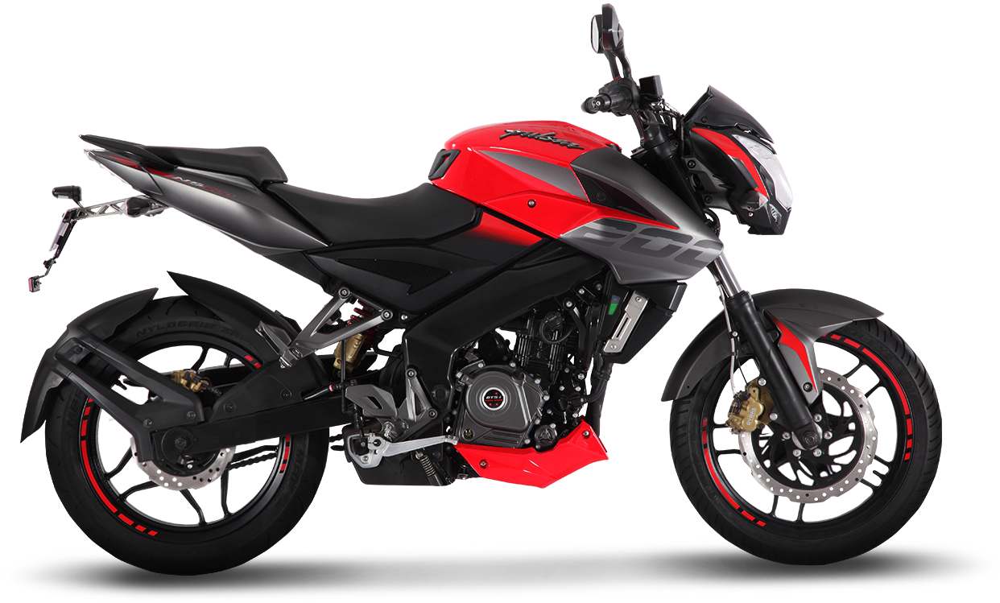
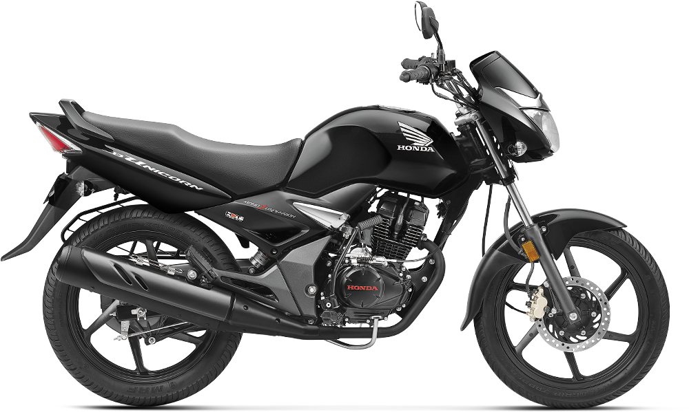

# MOTO LOGG 🏍️
### The Ultimate Motorcycle Expense & Mileage Tracker

[](https://flutter.dev)
[](https://riverpod.dev)
[](LICENSE)

**MOTO LOGG** is a premium, industrial-themed Flutter application designed for enthusiasts who want to track every penny spent on their machines. Built with a focus on performance, scalability, and high-end UI/UX.

---

## 📸 Screenshots

|          Dashboard           |            Analytics            |             Auth             |
|:----------------------------:|:-------------------------------:|:----------------------------:|
|  |  |  |
|     *Industrial Design*      |       *Expense Analytics*       |        *Secure Entry*        |

*(Place screenshots in `/assets/screenshots/` and update the placeholders above)*

---

## ✨ Features

- **Industrial UI/UX:** Dark mode first, premium typography (Plus Jakarta Sans), and a neon-accented color palette.
- **Micro-interactions:** Smooth animations using `flutter_animate` for a native, responsive feel.
- **Smart Tracking:** Categorize expenses (Fuel, Service, Mods, Accessories) with direct visual mapping to your bike.
- **Advanced Filtering:** View expenses by month, year, or all-time with real-time aggregate calculations.
- **Mileage Calculator:** Track fuel efficiency and cost-per-km over time.
- **Cloud Sync:** Firebase integration for secure authentication and real-time data persistence.

---

## 🛠️ Architecture & Tech Stack

This project follows **Clean Architecture** principles with a feature-first folder structure:

- **State Management:** [Riverpod](https://riverpod.dev) (v3.0+) for reactive, testable, and robust state logic. (No `setState` used).
- **Navigation:** [GoRouter](https://pub.dev/packages/go_router) for declarative routing.
- **Database:** Firebase Firestore for real-time data sync.
- **Animations:** `flutter_animate` for declarative entrance and micro-animations.
- **Theme:** Semantic Material 3 Design System.

```text
lib/
├── core/            # Theme, Routes, Constants, Common Utils
├── features/        # Feature-based modules (Auth, Home, Expenses)
│   ├── presentation/# UI, Notifiers, Widgets
│   ├── domain/      # Models, Entities
│   └── data/        # Repositories, Data Sources
├── models/          # Shared Data Models
├── providers/       # Global State Providers
├── services/        # External Service Integrations
└── widgets/         # Shared UI Components
```

---

## 🚀 Getting Started

1.  **Clone the repo:**
    ```bash
    git clone https://github.com/yourusername/moto_logg.git
    ```
2.  **Install dependencies:**
    ```bash
    flutter pub get
    ```
3.  **Setup Firebase:**
    - Create a project on [Firebase Console](https://console.firebase.google.com/).
    - Run `flutterfire configure` to set up your environment.
4.  **Run the app:**
    ```bash
    flutter run
    ```

---

## 👨‍💻 Author
**VIBIN K** - Senior Flutter Developer
*Passionate about building high-performance mobile experiences.*

---

## 📝 License
This project is licensed under the MIT License - see the [LICENSE](LICENSE) file for details.
